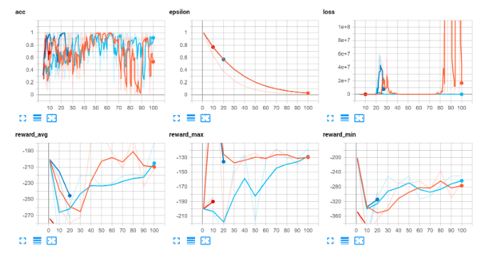

# Simple Autonomous Driving in CARLA

This project aims to develop a simple autonomous driving system for the CARLA simulator using deep reinforcement learning.

## Abstract

Autonomous driving is an emerging technology that promises to revolutionize the way we commute. In this project, we develop a simple autonomous driving 
system for the CARLA simulator using deep reinforcement learning. The system is trained to navigate the environment and avoid obstacles while following the 
rules of the road. The effectiveness of the system is evaluated using metrics such as success rate, average speed, and distance traveled.

## Description

The repository contains the code for the following tasks:

* Setting up the CARLA simulator
* Creating the environment and agent
* Training the agent using deep reinforcement learning
* Evaluating the performance of the agent

The CARLA simulator provides a realistic 3D environment for testing autonomous driving systems. We use the simulator to create an environment for the agent to navigate. The agent is trained using deep reinforcement learning techniques such as Q-learning and deep neural networks. The trained agent is then evaluated on its ability to navigate the environment and avoid obstacles.

## Results

The initial train video of results of the trained agent's performance are presented in the following clip:

The results of the trained agent's performance are presented in the following chart:

As you can see, the trained agent achieves decent success rates.

## Conclusion

In conclusion, this project demonstrates the effectiveness of using deep reinforcement learning for autonomous driving in the CARLA simulator. The trained agent is able to navigate the environment and avoid obstacles while following the rules of the road.

## Getting Started

To get started with this project, follow these steps:

1. Clone the repository: `git clone https://github.com/username/repo.git`
2. Install the required packages: `pip install -r requirements.txt`
3. Create the environment and agent: `python environment.py`
4. Train the agent: `python main.py`

